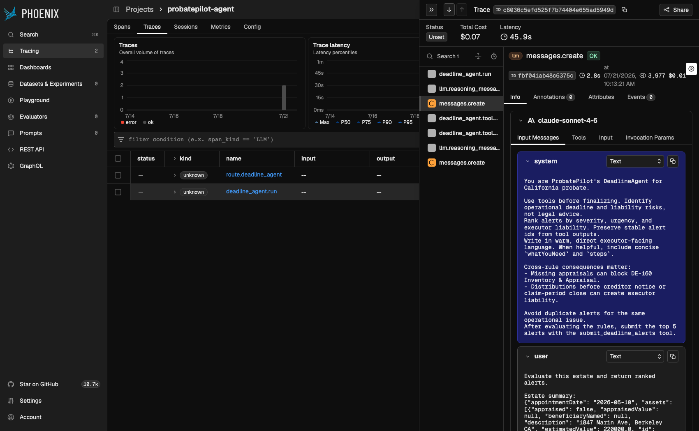

# ProbatePilot

**An AI copilot that keeps estate executors ahead of every probate deadline.**

Built in 24 hours at UC Berkeley AI Hackathon 2026 by a 4-person team, for the
technology-and-social-impact track.


### [**Try it live → probatepilot.vercel.app**](https://probatepilot.vercel.app)

[Run it locally in 3 commands](#quick-start) instead — see [`docs/DEPLOYMENT.md`](docs/DEPLOYMENT.md)
to put up your own version.

---

## The problem

When someone dies, the **executor** — usually a grieving family member, not a lawyer — is
personally on the hook for administering the estate: probate filings, an asset inventory,
creditor notices, debts paid in a specific legal order, taxes, distributions. Miss a
deadline, or pay creditors out of order, and the executor can be held *personally* liable
for the mistake. Most families can't afford a probate attorney for every question, so they
do this alone — typically over 100+ hours, with no one telling them what's coming next.

ProbatePilot reads the estate's documents, builds a live picture of what's known and what's
missing, and tells the executor the next action *before* it becomes expensive. It's scoped
to California probate law for now, and it knows what it doesn't know: for anything requiring
legal judgment, it says so plainly instead of guessing.

## What it does

- **Upload a document, get a structured estate.** A will, a deed, a bank statement, a
  creditor notice — Claude reads it and extracts the assets, debts, beneficiaries, and dates
  into one running estate record.
- **The DeadlineAgent watches the clock.** A deterministic California probate rule engine
  evaluates the estate against real statutory deadlines (DE-160 inventory, the 30-day
  creditor-notice window, debt payment order, and more); Claude then reasons over the result
  to rank and explain it in plain language. The rules always win — Claude can rewrite the
  copy, never the facts.
- **Ask it anything.** An estate-aware chat (text or voice) answers questions grounded in
  the executor's own uploaded documents, not generic advice.
- **It writes the letters.** Creditor notices, bank notifications, beneficiary updates —
  drafted from the estate's actual facts, ready to sign.

<p float="left">
  
  
</p>

## How it works

```
┌──────────────────────┐   HTTP / SSE   ┌───────────────────────────┐
│  web/ (Next.js 14)    │───────────────▶│  agent/ (FastAPI)         │
│  dashboard · chat     │◀───────────────│  DeadlineAgent · RAG chat │
│  voice (Deepgram)     │                │  document intelligence   │
│  Sentry                │                │  Phoenix tracing + evals │
└───────────┬───────────┘                └─────────────┬─────────────┘
            │                                            │
            └──────────────── Redis Cloud (estate KV + vector search) ─────┘
```

Two services, one shared store, each language doing what it's good at: Python owns Claude
reasoning and document parsing, TypeScript owns everything the user touches. The browser
never talks to the Python service directly — every call is proxied through Next.js, which
forwards the session as a bearer token server-side, so there's no CORS surface to manage.
**The deployed app persists to Redis Cloud** (Redis 8, KV + native Vector Sets for semantic
search) — a real managed cloud database, not local/ephemeral storage. The in-process
`memory` backend mentioned below exists purely so the repo boots with zero setup for local
dev; it's not what's actually running behind the live deploy.

**A few things worth a closer look if you're reading the code:**

- **The DeadlineAgent is deterministic-first.** `evaluate_rules()` runs a pure-function rule
  table against estate state and always produces a complete, correct alert set — with zero
  LLM involvement. Claude then gets a bounded tool-use loop to improve the wording, but its
  output is validated against the deterministic alerts and rejected if it drops or invents
  one. A missing API key or a bad model response both degrade to the same rule-evaluated
  alerts, just plainer prose. See [`docs/ARCHITECTURE.md`](docs/ARCHITECTURE.md).
- **Chat is real RAG, not the estate JSON stuffed into a system prompt and called a day.**
  Every uploaded document is chunked, embedded (OpenAI `text-embedding-3-small`, 1536-dim,
  with a deterministic hashing-trick fallback if unconfigured), and stored in a per-estate
  Redis 8 Vector Set. Each chat message embeds the query and retrieves the top 5 most
  relevant chunks *from that estate only* before Claude sees anything — a retrieval failure
  degrades to estate-state-only answers instead of failing the chat. See
  [`docs/ARCHITECTURE.md`](docs/ARCHITECTURE.md#core-ai-flows)'s Chat RAG flow and
  [`docs/database.md`](docs/database.md) for the vector storage details.
- **The store is a real backend abstraction, not a wrapper around one database.**
  `agent/store/` supports three interchangeable backends behind one API, selected by an env
  var — **Redis Cloud (Redis 8, KV + Vector Sets) is what the deployed app actually runs
  on**; an in-process in-memory backend (zero setup) and Upstash Redis are also fully
  implemented, mainly useful for local dev without provisioning anything. Estates are
  currently stored as one JSON string per estate rather than using Redis 8's native
  RedisJSON path operations (already available on this exact instance) — a real, scoped
  improvement, not a bottleneck at this app's scale: see
  [`docs/REDIS_DATA_MODEL_MIGRATION.md`](docs/REDIS_DATA_MODEL_MIGRATION.md).
- **Auth is session-based with real ownership checks, including in the demo.** Every
  estate-scoped endpoint requires a session and verifies the caller owns that estate — the
  demo is not an exception to this, it's automated: "Try the demo" mints a real session on a
  fresh, independent copy of the seed estate for that visitor only (self-expiring, no
  registration form), so one visitor's edits never show up for another.
- **Every Claude and OpenAI call is traced.** Phoenix spans wrap the full agent loop
  (`estate_id`, rules checked, fallback used, tool calls); an LLM-as-judge eval
  (`agent/evals/deadline_next_steps_quality.py`) scores the DeadlineAgent's output quality
  on real traces. Tracing is optional and degrades to a harmless connection warning with
  no collector running — see [`agent/README.md`](agent/README.md#phoenix-tracing) to spin
  one up locally and actually watch the traces.

  

  A real trace from a live run: the DeadlineAgent's tool-use loop (left), the exact
  `claude-sonnet-4-6` system prompt sent, and per-call cost/token/latency ($0.01, 3,977
  tokens, 2.8s for this step).
- **The DeadlineAgent's Claude calls use real prompt caching.** Its system prompt and tool
  schemas (~1,066 tokens, reused across up to 5 tool-use rounds per run) carry an Anthropic
  `cache_control` marker and measurably hit cache on repeat calls
  (`cache_read_input_tokens=1066`, verified live against the API, not assumed). The chat
  prompt is wired the same way but is currently under Anthropic's 1024-token cache-eligibility
  floor, so it's a documented no-op today rather than an overclaimed win — see
  [`docs/ARCHITECTURE.md`](docs/ARCHITECTURE.md#system-prompt-chat).
- **Two features are built but intentionally not exposed yet.** An email digest pipeline
  (Resend, human-toned templates, on-demand send) is fully working but gated behind a
  verified sending domain — see [`docs/DEPLOYMENT.md`](docs/DEPLOYMENT.md#known-follow-up-email-delivery).
  A `ResearchAgent` prototype exists but currently relies on unofficial news search with no
  real relevance judgment and isn't wired to any trigger — a source-verified redesign
  (poll the actual CA statute/form pages this app's own rules cite, diff their amendment
  dates) is fully scoped in [`docs/RESEARCH_AGENT_REDESIGN.md`](docs/RESEARCH_AGENT_REDESIGN.md),
  not yet built.

## Stack

| | |
|---|---|
| **AI** | Anthropic Claude (parsing, agent reasoning, chat, letters) · OpenAI embeddings |
| **Backend** | Python · FastAPI · Pydantic v2 · bcrypt · Resend (email) |
| **Frontend** | Next.js 14 · TypeScript · Zod · Deepgram (voice) · Sentry |
| **Data** | Redis Cloud (KV + Redis 8 Vector Sets) in production — pluggable to Upstash or an in-memory store for local dev |
| **Observability** | Arize Phoenix tracing + LLM-as-judge evals |

## Quick start

Requires [uv](https://docs.astral.sh/uv/) (manages the Python 3.11+ interpreter itself, no
separate install needed) and Node 18.18+ (`web/.nvmrc` pins 20 if you use nvm).

```bash
make env       # copy .env examples (won't overwrite existing files)
make install   # uv sync for agent/ (agent/uv.lock), npm install for web/ (web/package-lock.json)
make dev       # agent on :8000, web on :3000
```

`ANTHROPIC_API_KEY` in `agent/.env` is the only key the app requires to run at all — Redis,
Deepgram, Resend, and Phoenix are all genuinely optional and degrade cleanly when unset (the
default `STORE_BACKEND=memory` is a real, fully-working store, not a stub — it just doesn't
persist across restarts; without `DEEPGRAM_API_KEY`, the mic button tells you voice isn't set
up instead of silently doing nothing). `OPENAI_API_KEY` is a step above the rest, though:
without it, chat still runs rather than erroring, but retrieval falls back to a deterministic
hashing-trick bag-of-words vector instead of a real embedding — it still finds chunks that
share literal words with the query (better than nothing), just no understanding of synonyms
or paraphrasing. Set it too if you want the RAG chat to demonstrate genuinely grounded,
semantically-relevant answers. See [`agent/.env.example`](agent/.env.example) for the full
list.

```bash
make test      # Python + TypeScript contract tests
make lint      # ruff (agent/) + ESLint (web/)
```

**Trying it out**: click "Try the demo" for the fastest path — no signup, seeded estate,
alerts already firing. To see the document-intelligence pipeline itself run end to end,
register a real account instead and upload a few files from
[`examples/`](examples/README.md) — it includes a numbered happy-path order and a note on
which document types the parser recognizes today.

## Deploying your own

See [`docs/DEPLOYMENT.md`](docs/DEPLOYMENT.md) — Google Cloud Run for the agent
(recommended: measured 14s cold start on the real deployed service, vs. Render's ~30-60s)
or Render (simpler setup, a `render.yaml` blueprint is included), either
way defaulting to `STORE_BACKEND=redis_cloud` so real accounts persist past a restart, not
the in-memory backend; Vercel for the frontend. Required env vars: `ANTHROPIC_API_KEY` +
`REDIS_URL` on the agent side, `AGENT_API_URL` on the frontend side. Both sides can also
auto-deploy on every push to `main` (a Cloud Build trigger for the agent, a connected Git
repository for Vercel) — see `docs/DEPLOYMENT.md`'s "Auto-deploy on push" section for the
exact setup, including two real gotchas hit doing it: GitHub App repo-access scoping, and a
Vercel CLI path quirk in a monorepo.

## Project structure

```
agent/     Python FastAPI service — routers, DeadlineAgent, document parsing, store
web/       Next.js frontend — dashboard, chat, voice, letters
docs/      Architecture, database contract, evaluation methodology, deployment
examples/  Sample estate documents for trying the upload pipeline
```

Read [`docs/ARCHITECTURE.md`](docs/ARCHITECTURE.md) for the system diagram, the project
layout, the full API reference, data shapes, the probate rule table, and the demo scenario.

## Team

Built at UC Berkeley AI Hackathon 2026 by **Alex** (document intelligence), **Davyn** (data
layer & contracts), **Sameer** (DeadlineAgent & reasoning), and **Sherry** (frontend &
voice).

## License

[MIT](LICENSE)
